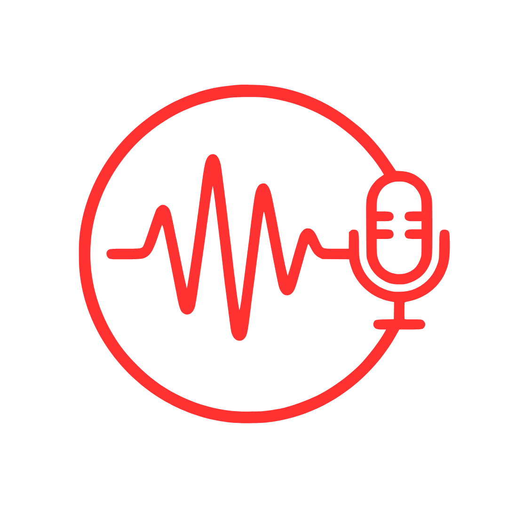

<p align="center">
  
</p>

<h1 align="center">Klarity</h1>

<p align="center">
  <strong>Personal AI Meeting Assistant for macOS</strong><br>
  Record meetings locally, transcribe them, identify speakers, and generate structured notes — no meeting bot required.
</p>

<p align="center">
  
  
  
</p>

---

## Architecture

```
SwiftUI macOS App  →  Local FastAPI Backend  →  ElevenLabs / Resemblyzer / LLM
```

| Layer            | Technology                                                    |
|------------------|---------------------------------------------------------------|
| Frontend         | Swift + SwiftUI (macOS 14+)                                  |
| Backend          | Python 3.11+ FastAPI + Uvicorn                               |
| Database         | SQLite via SQLAlchemy                                         |
| System audio     | Core Audio Process Tap (`CATapDescription`, macOS 14.2+)      |
| Microphone       | AVAudioEngine inputNode tap                                   |
| Audio mixing     | Streaming float32 average of two temp WAVs → `audio.wav`     |
| Audio preproc    | FFmpeg (16kHz mono normalization)                             |
| Transcription    | ElevenLabs Scribe (speaker diarization)                       |
| Speaker ID       | Resemblyzer d-vectors + cosine similarity                     |
| LLM              | OpenAI / Anthropic / Gemini / Ollama                          |
| Calendar         | Google Calendar API v3 + Microsoft Graph (PKCE OAuth)        |

All data stays on-device unless cloud APIs are explicitly configured.

---

## Getting Started

### Prerequisites

- macOS 14+ (Sonoma or later)
- Xcode 15+
- Homebrew
- Python 3.11+

### 1. Clone

```bash
git clone https://github.com/neznuo/KlarityApp.git
cd KlarityApp
```

### 2. Install system dependency

```bash
brew install ffmpeg
```

### 3. Set up the Python backend

```bash
cd backend
python3 -m venv venv
source venv/bin/activate
pip install -r requirements.txt
cp .env.example .env
```

Edit `backend/.env` and add your API keys:

| Key                    | Required | Purpose                        |
|------------------------|----------|--------------------------------|
| `ELEVENLABS_API_KEY`   | Yes      | Transcription + speaker diarization |
| `OPENAI_API_KEY`       | No       | LLM summarization              |
| `ANTHROPIC_API_KEY`    | No       | LLM summarization              |
| `GEMINI_API_KEY`       | No       | LLM summarization              |
| `OLLAMA_ENDPOINT`      | No       | Local LLM (e.g. `http://localhost:11434`) |

At minimum, set `ELEVENLABS_API_KEY` and one LLM provider. If using Ollama, set `DEFAULT_LLM_PROVIDER=ollama` and `DEFAULT_LLM_MODEL=llama3`.

### 4. Set up OAuth client IDs (for Calendar Sync)

Calendar Sync lets upcoming meetings appear as one-tap auto-fill pills when you start a recording. It's optional — the app works without it.

```bash
cd apps/macos
cp Secrets.xcconfig.example Secrets.xcconfig
```

Edit `apps/macos/Secrets.xcconfig` and replace the placeholder values:

```
GOOGLE_CLIENT_ID = your-client-id.apps.googleusercontent.com
GOOGLE_REVERSE_CLIENT_ID = com.googleusercontent.apps.your-client-id-prefix
MICROSOFT_CLIENT_ID = your-azure-app-client-id
```

**Where to get these:**

<details>
<summary>Google Calendar</summary>

1. Go to [Google Cloud Console](https://console.cloud.google.com/) → APIs & Services → Credentials
2. Create an **OAuth 2.0 Client ID**, application type **iOS**
3. Set the redirect URI: `klarity://oauth/google/callback`
4. Enable the **Google Calendar API** for the project
5. The client ID goes in `GOOGLE_CLIENT_ID`
6. The reverse client ID is `com.googleusercontent.apps.` + everything before `.apps.googleusercontent.com`

</details>

<details>
<summary>Microsoft Outlook</summary>

1. Go to [Azure Portal](https://portal.azure.com/) → App registrations → New registration
2. Add redirect URI (platform: **Mobile and desktop applications**): `klarity://oauth/microsoft/callback`
3. Under API permissions, add `Calendars.Read` and `offline_access`

</details>

`Secrets.xcconfig` is gitignored — it will never be committed.

### 5. Configure Xcode build phase (one-time)

The Python backend gets bundled into the `.app` automatically via a build script. Set it up once:

1. Open `apps/macos/KlarityApp.xcodeproj` in Xcode
2. Select the **KlarityApp** target → **Build Phases** → **+** → **New Run Script Phase**
3. Paste the script path:
   ```
   "${SRCROOT}/scripts/bundle_backend.sh"
   ```
4. Uncheck **"Based on dependency analysis"**
5. Drag the phase to run **after Compile Sources** but **before Copy Bundle Resources**

Every subsequent build will automatically bundle the backend + venv into the app.

### 6. Build & Run

**Option A: Xcode**

Open the project and press `⌘R`.

**Option B: Command line**

```bash
./scripts/build.sh 2>&1 | tail -30
```

On success, the build script prints the path to the `.app` bundle. Run it:

```bash
open /tmp/KlarityApp-build/Build/Products/Debug/KlarityApp.app
```

The app launches the embedded Python backend automatically (~2s warmup) and shuts it down cleanly on quit.

---

## Project Structure

```
KlarityApp/
├── apps/macos/
│   ├── KlarityApp.xcodeproj/       # Xcode project
│   ├── project.yml                 # XcodeGen source of truth
│   ├── Shared.xcconfig             # Build config (committed, placeholder values)
│   ├── Secrets.xcconfig            # OAuth client IDs (gitignored)
│   ├── Secrets.xcconfig.example    # Template for Secrets.xcconfig
│   └── PersonalAIMeetingAssistant/
│       ├── App/                    # Entry point, AppState, ContentView
│       ├── Models/                 # Swift data models
│       ├── ViewModels/             # Observable ViewModels
│       ├── Services/               # APIClient, AudioRecorder, KeychainService,
│       │                           # BackendProcessManager, CalendarService
│       └── Features/
│           ├── Home/               # Meeting list + search
│           ├── Recording/          # Recording sheet
│           ├── MeetingDetail/      # Tabbed detail view + audio player
│           ├── Transcript/         # Transcript viewer
│           ├── People/             # Known people library
│           ├── Onboarding/         # First-run setup wizard
│           ├── ActionItems/        # Action items list
│           └── Settings/           # API keys, permissions, storage
├── scripts/
│   ├── build.sh                    # Debug build wrapper
│   └── bundle_backend.sh           # Xcode build phase: copies venv into .app
└── backend/
    ├── app/
    │   ├── api/                    # FastAPI routers
    │   ├── core/                   # config.py (Pydantic Settings)
    │   ├── db/                     # SQLAlchemy setup + init
    │   ├── models/                 # ORM models
    │   ├── schemas/                # Pydantic request/response schemas
    │   ├── services/
    │   │   ├── audio/              # FFmpeg preprocessor
    │   │   ├── transcription/      # ElevenLabs provider
    │   │   ├── embeddings/         # Resemblyzer speaker embeddings
    │   │   ├── summarization/      # OpenAI / Anthropic / Gemini / Ollama
    │   │   └── storage/            # File layout helpers
    │   ├── workers/                # Processing pipeline orchestration
    │   └── prompts/                # LLM system prompts
    ├── tests/
    ├── requirements.txt
    ├── pyproject.toml               # Ruff + pytest config
    └── .env.example
```

---

## How It Works

1. **Record** — Click "New Recording". System audio and microphone are captured on separate paths into temp WAV files
2. **Mix** — On stop, both sources are averaged sample-by-sample into a single `audio.wav`
3. **Transcribe** — ElevenLabs Scribe returns timestamped segments with speaker IDs
4. **Identify** — Resemblyzer computes voice embeddings and matches against known people
5. **Summarize** — Click "Generate Summary" to produce structured notes and action items via your chosen LLM

Meeting processing is fully asynchronous — you can start a new recording immediately after stopping one.

---

## Configuration Reference

### Environment Variables (`backend/.env`)

| Key                         | Default                   | Description                          |
|-----------------------------|---------------------------|--------------------------------------|
| `BASE_STORAGE_DIR`          | `~/Documents/AI-Meetings` | Local data root                      |
| `ELEVENLABS_API_KEY`        | —                         | Required for transcription           |
| `DEFAULT_TRANSCRIPTION_PROVIDER` | `elevenlabs`         | Transcription provider               |
| `OPENAI_API_KEY`            | —                         | OpenAI LLM                           |
| `ANTHROPIC_API_KEY`         | —                         | Anthropic LLM                        |
| `GEMINI_API_KEY`            | —                         | Google Gemini LLM                    |
| `OLLAMA_ENDPOINT`           | —                         | Local Ollama endpoint                |
| `DEFAULT_LLM_PROVIDER`     | `ollama`                  | Default LLM provider                 |
| `DEFAULT_LLM_MODEL`         | `llama3`                  | Default LLM model                    |
| `SPEAKER_SUGGEST_THRESHOLD` | `0.75`                    | Cosine similarity to suggest a match |
| `SPEAKER_AUTO_ASSIGN_THRESHOLD` | `0.90`               | Cosine similarity to auto-assign     |
| `SPEAKER_DUPLICATE_THRESHOLD` | `0.82`                  | Duplicate speaker detection          |
| `BACKEND_PORT`              | `8765`                    | Backend server port                  |
| `LOG_LEVEL`                 | `INFO`                    | Logging verbosity                    |

### Speaker Recognition Thresholds

Adjustable in Settings:

| Threshold | Default | Behavior                              |
|-----------|---------|---------------------------------------|
| Suggest   | 0.75    | Show as a suggested match             |
| Auto-assign | 0.90  | Assign without prompting              |
| Duplicate | 0.82    | Detect same speaker across clusters   |

---

## Running Tests

```bash
cd backend
source venv/bin/activate
pytest tests/ -v
```

Lint:

```bash
cd backend
ruff check app/
```

---

## Design Constraints

- **No meeting bots** — records local audio only
- **No live transcription** — post-meeting processing only
- **Summary generation is manual** — user clicks the button
- **All data stays local** unless cloud APIs are explicitly configured
- API keys and OAuth tokens stored in **macOS Keychain** (Swift) and `.env` (backend)
- Calendar OAuth is handled entirely in Swift — the backend only stores calendar event IDs

---

## Data Storage

```
~/Documents/AI-Meetings/
├── meetings/{meeting_id}/
│   ├── audio.wav              # Mixed recording (16kHz mono int16)
│   ├── normalized.wav         # FFmpeg-normalized output
│   ├── transcript.raw.json    # Raw ElevenLabs response
│   ├── transcript.json        # Structured speaker segments
│   ├── summary.json           # LLM structured output
│   ├── summary.md             # Human-readable summary
│   └── tasks.json             # Extracted action items
├── voices/{person_id}.npy     # Resemblyzer voice embeddings
└── logs/
    ├── app.db                  # SQLite database
    └── backend.log             # Backend process log
```